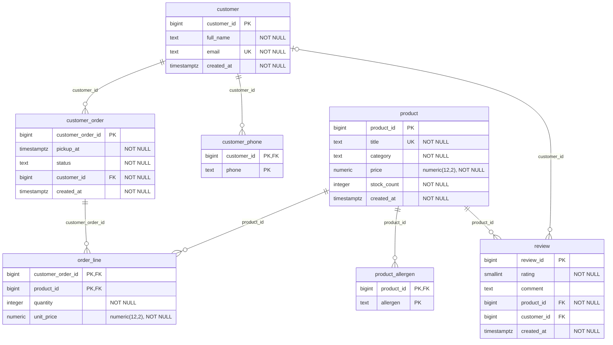

# bakery: data model

Read from the live database after `deploy` (7 tables in schema `bakery`).

```mermaid
erDiagram
    customer ||--o{ customer_order : "customer_id"
    customer ||--o{ customer_phone : "customer_id"
    customer |o--o{ review : "customer_id"
    customer_order ||--o{ order_line : "customer_order_id"
    product ||--o{ order_line : "product_id"
    product ||--o{ product_allergen : "product_id"
    product ||--o{ review : "product_id"
    customer {
        bigint customer_id PK
        text full_name "NOT NULL"
        text email UK "NOT NULL"
        timestamptz created_at "NOT NULL"
    }
    customer_order {
        bigint customer_order_id PK
        timestamptz pickup_at "NOT NULL"
        text status "NOT NULL"
        bigint customer_id FK "NOT NULL"
        timestamptz created_at "NOT NULL"
    }
    customer_phone {
        bigint customer_id PK, FK
        text phone PK
    }
    order_line {
        bigint customer_order_id PK, FK
        bigint product_id PK, FK
        integer quantity "NOT NULL"
        numeric unit_price "numeric(12,2), NOT NULL"
    }
    product {
        bigint product_id PK
        text title UK "NOT NULL"
        text category "NOT NULL"
        numeric price "numeric(12,2), NOT NULL"
        integer stock_count "NOT NULL"
        timestamptz created_at "NOT NULL"
    }
    product_allergen {
        bigint product_id PK, FK
        text allergen PK
    }
    review {
        bigint review_id PK
        smallint rating "NOT NULL"
        text comment
        bigint product_id FK "NOT NULL"
        bigint customer_id FK
        timestamptz created_at "NOT NULL"
    }
```
